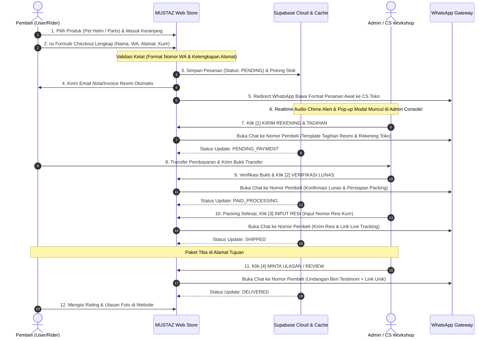

# DOKUMENTASI SISTEM & ALUR PEMESANAN MUSTAZ CRAFT
**Sistem E-Commerce & WhatsApp Automation Terintegrasi**  
*Versi Arsitektur: 2.0 (Supabase Real-Time, WhatsApp CS Automation & Multi-Channel Sync)*

---

## 📌 DAFTAR ISI
1. [Ringkasan Eksekutif Sistem](#ringkasan-eksekutif-sistem)
2. [Diagram Alur End-to-End (Workflow Diagram)](#diagram-alur-end-to-end)
3. [Alur Pemesanan dari Sisi Pembeli (User / Rider)](#1-alur-pemesanan-dari-sisi-pembeli-user--rider)
4. [Alur Manajemen Pesanan dari Sisi Admin (Admin CS Console)](#2-alur-manajemen-pesanan-dari-sisi-admin-admin-cs-console)
5. [Tabel Matriks Status & Otomasi CS](#3-tabel-matriks-status--otomasi-cs)
6. [Fitur Keamanan & Validasi Data (Anti-Error Guard)](#4-fitur-keamanan--validasi-data-anti-error-guard)

---

## 🌟 RINGKASAN EKSEKUTIF SISTEM

Platform MUSTAZ CRAFT menerapkan konsep **Hybrid Direct-to-Consumer (D2C) E-Commerce**, yang menggabungkan:
1. **Kenyamanan Web Store Modern:** Keranjang belanja interaktif, katalog parts kustom, multi-currency switcher (IDR & USD), profil akun member, dan riwayat pesanan digital.
2. **Keandalan Database Cloud:** Menggunakan **Supabase Database** dengan sinkronisasi **Real-time WebSockets**.
3. **Sentuhan Personal via WhatsApp Automation:** CS tidak perlu mengetik manual rincian tagihan, rekening, resi, maupun link ulasan. Seluruh data diproses secara otomatis via template 1-Klik dari Admin Console ke nomor WhatsApp pembeli.

---

## 🔄 DIAGRAM ALUR END-TO-END

---

## 👤 1. ALUR PEMESANAN DARI SISI PEMBELI (USER / RIDER)

Berikut adalah langkah-langkah yang dilalui pembeli saat berbelanja di website MUSTAZ CRAFT:

### Langkah 1: Eksplorasi Produk & Pemilihan Varian
- Pembeli mengunjungi website utama (`index.html`) atau katalog kustom parts (`parts.html`).
- Pembeli dapat memilih mata uang yang diinginkan (**IDR `Rp`** atau **USD `$`**). Seluruh harga produk dan promo Flash Sale otomatis menyesuaikan kurs secara instan.
- Pembeli memilih item pet visor/helm dan menekan tombol **"ADD TO CART"** atau **"INSTANT BUY"**.

### Langkah 2: Mengatur Keranjang Belanja (Cart Drawer)
- Pembeli membuka ikon keranjang belanja di pojok kanan atas layar.
- Drawer keranjang muncul menampilkan daftar produk, foto preview, jumlah kuantitas (`+` / `-`), dan Subtotal Manifest.
- Pembeli menekan tombol **"CHECKOUT VIA WHATSAPP →"** untuk melanjutkan ke konfirmasi pengiriman.

### Langkah 3: Mengisi Formulir Checkout (Mandatory Protocol)
Formulir pemesanan menerapkan validasi data ketat agar pesanan tidak mengalami salah kirim:
1. **Nama Lengkap / Alias Rider:** Wajib diisi (identitas penerima paket).
2. **Nomor WhatsApp:** Wajib angka aktif minimal 10 digit (contoh: `081234567890` atau `6281234567890`). Sistem menolak format tidak valid.
3. **Email Notifikasi:** Wajib alamat email valid (untuk menerima berkas invoice resmi).
4. **Alamat Lengkap Pengiriman:** Wajib diisi nama jalan, nomor rumah, RT/RW, kecamatan, kota, dan kode pos.
5. **Pilihan Kurir Ekspedisi:** Pembeli memilih opsi pengiriman:
   - *J&T Express (Reguler / COD)*
   - *JNE Trucking / Reguler*
   - *SiCepat Cargo / Best*
   - *GoSend / Grab Instant (JABODETABEK)*
   - *Ambil Langsung di Workshop MUSTAZ*
6. **Metode Pembayaran:** Transfer Bank (BCA / Mandiri), QRIS Instant, COD, atau Negosiasi Langsung via WA.

### Langkah 4: Pembuatan Order & Notifikasi Instan
Saat tombol **"CONFIRM ORDER VIA WHATSAPP →"** ditekan:
1. **Order ID Dibuat:** Sistem menerbitkan kode pesanan unik (contoh: `#MSTZ-4821`).
2. **Pencatatan Database:** Data pesanan langsung tercatat di Supabase Cloud Orders dan riwayat akun member (`account.html`).
3. **Pemotongan Stok:** Stok inventori produk berkurang secara otomatis.
4. **Invoice Email:** Email konfirmasi pesanan dikirim otomatis ke kotak masuk email pembeli.
5. **Pengalihan ke WhatsApp CS:** Sistem otomatis membuka aplikasi WhatsApp menuju kontak resmi CS Toko MUSTAZ (`0895-4028-06350`) membawa format pesanan siap kirim.

### Langkah 5: Pembayaran & Penerimaan Resi
- Pembeli menerima pesan WhatsApp dari CS berisi nomor rekening resmi toko.
- Setelah membayar, pembeli mengirimkan bukti transfer.
- Saat pesanan dikirim, pembeli menerima pesan WhatsApp berisi **Kurir Ekspedisi & Nomor Resi Pelacakan**.

### Langkah 6: Menerima Pesanan & Mengisi Ulasan
- Saat barang tiba, pembeli menerima pesan WhatsApp berisi link ulasan resmi (`testimoni.html?review_order=MSTZ-xxxx`).
- Pembeli dapat mengunggah foto visor yang terpasang di helm, memberikan rating bintang (1-5), dan testimonial yang akan ditampilkan di halaman galeri komunitas.

---

## 🛠️ 2. ALUR MANAJEMEN PESANAN DARI SISI ADMIN (ADMIN CS CONSOLE)

Admin mengelola seluruh pesanan melalui **Admin Dashboard Console** (`/admin`). Sistem dirancang serba otomatis dan aman dari human error:

### Langkah 1: Notifikasi Suara & Pop-Up Real-Time
- Admin tidak perlu terus-menerus me-refresh halaman browser.
- Saat ada pembeli yang melakukan checkout, koneksi **Supabase Real-Time WebSockets** mendeteksi data baru dalam hitungan detik.
- **Synthesizer Chime Alert:** Komputer admin otomatis membunyikan nada chime audio ramah (*G5-B5-D6*).
- **Pop-Up Order Baru:** Muncul modal peringatan berisi Nomor Order, Nama Pembeli, Total Belanja, dan tombol instan *"LIHAT PESANAN →"*.
- Badge counter pesanan di sidebar kiri otomatis bertambah.

### Langkah 2: Membuka Daftar Pesanan (Order Management)
- Admin membuka menu **ORDERS (PESANAN)**.
- Setiap pesanan baru memiliki indikator warna khusus:
  - Garis aksen kuning brutalist + label `⚡ BARU`.
  - Tertera tanggal, nama pembeli, rincian barang, total nominal rupiah, dan status saat ini (`PENDING`).

### Langkah 3: Tindakan Fase 1 — Kirim Rekening & Tagihan
- Admin menekan tombol kuning: **`[1] 💳 KIRIM REKENING & TAGIHAN`**.
- **Logika Otomatisasi Sistem:**
  1. Sistem membaca nomor WhatsApp pembeli (`order.customer_phone` atau `order.phone`).
  2. Nomor otomatis distandarisasi ke format internasional (`628...`).
  3. Sistem menyusun pesan tagihan resmi toko yang memuat:
     - Nama pembeli dan Kode Order.
     - Rincian barang pesanan.
     - Total tagihan yang harus dibayar.
     - Daftar rekening bank resmi MUSTAZ (BCA, Mandiri) dan QRIS.
  4. Sistem otomatis membuka WhatsApp Web/Desktop langsung ke **Nomor WhatsApp Pembeli** *(Bukan nomor admin sendiri)*.
  5. Status pesanan diubah otomatis menjadi **`PENDING_PAYMENT`**.

### Langkah 4: Tindakan Fase 2 — Verifikasi Pembayaran Lunas
- Setelah pembeli mengirim bukti transfer, Admin dapat menekan tombol **`📸 LIHAT BUKTI / + LAMPIRKAN`** untuk memverifikasi atau menyimpan gambar struk bukti transfer.
- Admin menekan tombol hijau: **`[2] ✅ VERIFIKASI LUNAS`**.
- **Logika Otomatisasi Sistem:**
  1. WhatsApp otomatis terbuka ke nomor pembeli berisi ucapan terima kasih bahwa pembayaran telah sah diverifikasi.
  2. Pembeli diberi info bahwa produk masuk antrean QC & packing workshop.
  3. Status pesanan diubah otomatis menjadi **`PAID_PROCESSING`**.

### Langkah 5: Tindakan Fase 3 — Input Resi & Notifikasi Pengiriman
- Setelah paket diserahkan ke kurir ekspedisi, Admin menekan tombol ungu: **`[3] 📦 INPUT RESI & SHIPPED`**.
- Muncul modal **Input Resi Pengiriman**:
  - Admin memilih kurir ekspedisi yang digunakan (J&T, JNE, SiCepat, dll).
  - Admin mengetik nomor resi fisik kurir.
- Admin menekan tombol **"SUBMIT & KIRIM RESI"**.
- **Logika Otomatisasi Sistem:**
  1. Nomor resi dan nama kurir tersimpan ke database pesanan.
  2. Sistem membuka WhatsApp ke nomor pembeli membawa ucapan pemberitahuan paket telah meluncur beserta **Link Live Tracking Kurir**.
  3. Status pesanan diubah otomatis menjadi **`SHIPPED`**.

### Langkah 6: Tindakan Fase 4 — Permintaan Ulasan & Review
- Ketika paket telah sampai di tangan pelanggan (atau admin menekan `✓ DELIVERED`), Admin menekan tombol: **`[4] ⭐ MINTA ULASAN / REVIEW`**.
- **Logika Otomatisasi Sistem:**
  1. WhatsApp terbuka ke nomor pembeli membawa link langsung ulasan resmi: `https://mustazbuildtest.vercel.app/testimoni.html?review_order=MSTZ-xxxx`.
  2. Status pesanan menjadi **`DELIVERED`** (Transaksi Sukses & Selesai).

### Langkah 7: Moderasi Testimoni Pelanggan
- Ulasan yang dikirim pembeli masuk ke menu **REVIEWS / TESTIMONI** di Admin Console.
- Admin dapat melihat foto helm, rating bintang, dan feedback pelanggan.
- Admin memiliki kendali untuk menyetujui ulasan (*Approved*) agar langsung tampil di etalase website atau menyembunyikannya jika mengandung spam.

---

## 📊 3. TABEL MATRIKS STATUS & OTOMASI CS

| Status Pesanan | Indikator Visual | Tombol Aksi Admin | Target WhatsApp | Pesan Otomatis yang Terkirim |
| :--- | :--- | :--- | :--- | :--- |
| **`PENDING`** | Kuning Neon `⚡ BARU` | `[1] KIRIM REKENING & TAGIHAN` | Nomor WA Pembeli | Rincian belanja, total tagihan, daftar rekening bank & QRIS resmi toko. |
| **`PENDING_PAYMENT`** | Oranye Klasik | *Menunggu Transfer / Verifikasi* | Nomor WA Pembeli | Follow up invoice tagihan. |
| **`PAID_PROCESSING`** | Hijau Neon | `[2] VERIFIKASI LUNAS` / `[3] INPUT RESI` | Nomor WA Pembeli | Konfirmasi bahwa pembayaran valid & paket mulai dipacking. |
| **`SHIPPED`** | Ungu Neon | `[3] INPUT RESI` / `✓ DELIVERED` | Nomor WA Pembeli | Informasi kurir ekspedisi, nomor resi pengiriman, dan tautan live tracking. |
| **`DELIVERED`** | Hijau Solid `✓ COMPLETED` | `[4] MINTA ULASAN / REVIEW` | Nomor WA Pembeli | Ucapan terima kasih & undangan memberikan review produk via link khusus. |
| **`CANCELLED`** | Merah Outline | `-` | - | Pesanan dibatalkan / tidak dilanjutkan. |

---

## 🛡️ 4. FITUR KEAMANAN & VALIDASI DATA (ANTI-ERROR GUARD)

1. **Anti-Chat Diri Sendiri (Self-Chat Prevention):**
   - Pada versi terdahulu, jika nomor pembeli tidak terdeteksi, sistem memiliki fallback ke nomor admin toko.
   - Pada arsitektur saat ini, helper `getCustomerWhatsAppNumber()` dan `openAdminWhatsAppAction()` mewajibkan nomor telepon pembeli valid. Jika nomor pembeli tidak ditemukan atau di bawah 10 digit, sistem **memblokir aksi WhatsApp** dan memunculkan notifikasi peringatan (*"Nomor WhatsApp pembeli tidak valid"*), mencegah admin salah menge-chat nomor sendiri.
2. **Validasi Formulir Wajib (Mandatory Guard):**
   - Formulir checkout tidak dapat dikirim jika salah satu dari 4 data pokok kosong: **Nama, Nomor WhatsApp, Kurir Ekspedisi, dan Alamat Lengkap**.
   - Input WhatsApp diproteksi dengan regex pattern `^[0-9]{9,15}$` dan verifikasi digit minimal di layer JavaScript.
3. **Format Standar Nomor Internasional:**
   - Nomor yang diinput dengan format lokal (misal: `0812...` atau `812...`) secara otomatis dikonversi oleh sistem ke format standar `62812...` sebelum disimpan ke database dan dieksekusi ke URL `wa.me/`.
4. **Isolasi Error Dashboard:**
   - Seluruh event listener tombol Admin diinisialisasi secara sinkron di awal load script. Jika terjadi gangguan jaringan saat membaca data cloud, seluruh tombol tab dan aksi di Admin Dashboard tetap responsif dan tidak hang/freeze.
5. **Redundansi Penyimpanan (Dual Storage Redundancy):**
   - Setiap pesanan yang dibuat disimpan di **dua layer sekaligus**: Supabase Cloud Database (sebagai sumber utama real-time) dan LocalStorage Browser Cache (sebagai cadangan offline instan).

---

*Dokumentasi ini disiapkan untuk pengembang, pemilik toko, dan tim Customer Service MUSTAZ CRAFT.*  
*Domain Produksi Aktif:* [https://mustazbuildtest.vercel.app](https://mustazbuildtest.vercel.app)
