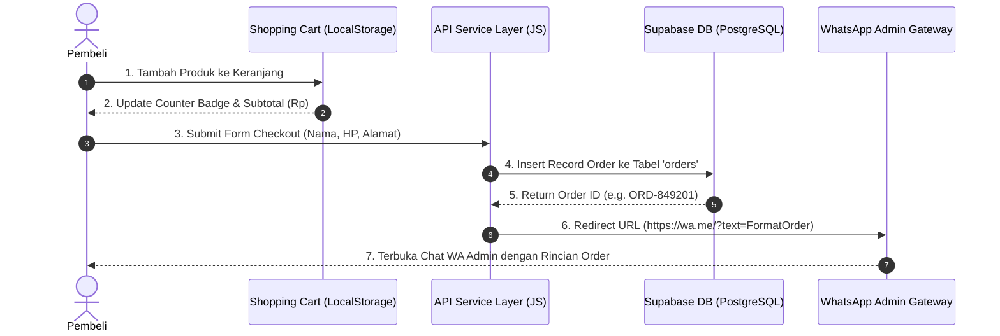

# 🔬 Dokumen Research & Development (R&D)
## Project: MUSTAZ BRAND STORE — E-Commerce Web Architecture

---

## 1. Executive Summary

Dokumen R&D ini menyusun riset arsitektur teknis, pemilihan stack, spesifikasi bahasa pemrograman, serta alur integrasi untuk **MUSTAZ Brand Store**. Fokus utama R&D ini adalah membangun **arsitektur web yang fleksibel, cepat, dan siap di-skinning** tanpa ketergantungan pada UI Figma yang masih dalam proses perancangan, sekaligus mengintegrasikan sistem pesanan langsung (*Direct WhatsApp Gateway*) dan database serverless (*Supabase PostgreSQL*).

---

## 2. Spesifikasi Bahasa Pemrograman & Standar Teknologi

| Komponen | Bahasa / Spesifikasi | Standard / Versi | Fungsi Dalam Sistem |
| :--- | :--- | :--- | :--- |
| **Logic & App Engine** | **JavaScript** | ES6+ (ECMAScript 2022) | Mengelola modul logika (`import`/`export`), manipulasi DOM, state keranjang belanja, kalkulasi harga, & event listener. |
| **Markup & Structure** | **HTML5** | W3C Standard | Membangun elemen semantik (`<header>`, `<nav>`, `<section>`, `<form>`) & aksesibilitas web. |
| **Styling & Design System** | **CSS3** | Modern CSS Spec | Mengatur tata letak (Flexbox & Grid), variabel Design Tokens (`:root`), efek Glassmorphism, & animasi UI. |
| **Database Query** | **SQL** | PostgreSQL Dialect | Mendefinisikan struktur data (`CREATE TABLE`), tipe data `JSONB`, serta aturan keamanan *Row Level Security (RLS)*. |
| **Documentation** | **Markdown** | CommonMark / GFM | Format penulisan panduan setup (`SUPABASE_SETUP.md`) & laporan R&D (`RND_SPEC.md`). |

---

## 3. Riset Selection Tech Stack & Arsitektur

| Layer | Teknologi / Tool | Alasan Pemilihan R&D |
| :--- | :--- | :--- |
| **Frontend Core** | Native HTML5 + JavaScript ES6 Modules | Zero build step overhead, kecepatan muat instan (< 1 detik), modularitas tinggi tanpa dependensi berat. |
| **Styling Architecture** | Vanilla CSS Custom Properties | Variabel CSS (`:root`) memetakan 1-to-1 variabel Figma (Color, Typography, Spacing). |
| **Database Service** | Supabase (PostgreSQL Cloud) | Realtime database, SDK JS berbasis CDN, Row Level Security (RLS), dan performa tinggi. |
| **Order Gateway** | Direct WhatsApp API URI Scheme | Mengoptimalkan *conversion rate* pasar Indonesia (pembeli lebih nyaman transaksi via WA). |
| **State Management** | LocalStorage API + Custom Events | Manajemen keranjang belanja (*Shopping Cart*) ringan tanpa memerlukan Redux/Zustand. |

---

## 4. Protokol Integrasi & API Gateway

1. **Supabase Realtime & REST API (HTTP/2 & WebSocket):**
   - Menggunakan `@supabase/supabase-js` v2 via ESM CDN Loader (`https://cdn.jsdelivr.net/...`).
   - Berkomunikasi melalui protokol HTTPS REST API untuk operasi CRUD (`SELECT`, `INSERT`) dan WebSockets (`postgres_changes`) untuk update *real-time*.

2. **WhatsApp Direct Order URI Scheme:**
   - Menggunakan URI Scheme `https://wa.me/{ADMIN_WHATSAPP}?text={ENCODED_PAYLOAD}`.
   - Data rincian pesanan di-encode menggunakan `encodeURIComponent()` untuk menjamin karakter baris baru (`\n`), emoji, dan format teks tebal (`*bold*`) terbaca dengan sempurna di WhatsApp Web/Mobile.

3. **Format Currency Handling:**
   - Menggunakan JavaScript Native API `Intl.NumberFormat('id-ID', { style: 'currency', currency: 'IDR' })` untuk mengkonversi nilai angka integer menjadi format mata uang Rupiah (`Rp`) secara presisi.

---

## 5. Arsitektur Figma Hand-off Workflow (Design System Tokens)

```text
Figma Inspect Panel (Design System)
             │
             ▼ (Map 1-to-1 Variables)
    css/variables.css  ──────►  css/components.css  ──────►  index.html (UI Render)
    ├── --primary-500           ├── .btn-primary
    ├── --font-sans             ├── .card
    └── --space-md              └── .form-input
```

### Pemisahan Layer Aplikasi:
1. **Visual Layer (`css/`)**: Hanya mengontrol estetika (Warna, Font, Shadow).
2. **Logic Layer (`js/`)**: Mengontrol data keranjang, integrasi Supabase, dan checkout WA.
3. **Data Layer (`js/services/`)**: Mengabstraksi panggilan database agar UI tidak peduli dari mana data berasal.

---

## 6. Alur Data & Transaksi (Data Flow Architecture)



---

## 7. Skema Database & Integritas Data (Supabase PostgreSQL)

### A. Tabel Katalog (`products`)
```sql
CREATE TABLE public.products (
  id UUID DEFAULT gen_random_uuid() PRIMARY KEY,
  name TEXT NOT NULL,
  category TEXT NOT NULL DEFAULT 'Apparel',
  price NUMERIC NOT NULL,
  original_price NUMERIC,
  badge TEXT,
  description TEXT,
  image_url TEXT,
  created_at TIMESTAMPTZ DEFAULT NOW()
);
```

### B. Tabel Pesanan (`orders`)
```sql
CREATE TABLE public.orders (
  id UUID DEFAULT gen_random_uuid() PRIMARY KEY,
  customer_name TEXT NOT NULL,
  customer_phone TEXT NOT NULL,
  customer_address TEXT NOT NULL,
  payment_method TEXT DEFAULT 'Transfer Bank',
  items JSONB NOT NULL,
  total_amount NUMERIC NOT NULL,
  status TEXT DEFAULT 'PENDING',
  created_at TIMESTAMPTZ DEFAULT NOW()
);
```

---

## 8. Requirements Lingkungan Sistem (Environment Requirements)

- **Browser Engine Minimum:** Google Chrome 90+, Mozilla Firefox 88+, Safari 14+, Microsoft Edge 90+.
- **Web Server:** Static File Server (Nginx, Apache, Node.js `serve`, Vercel, Netlify).
- **Database Engine:** PostgreSQL 15+ (Cloud Hosted via Supabase Infrastructure).

---

## 9. Roadmap Pengembangan (Development Phases)

- [x] **Fase 1 (Selesai):** Fondasi Arsitektur JavaScript ES6, CSS Design Tokens, Integrasi Client Supabase, & Fitur Direct WhatsApp Checkout.
- [ ] **Fase 2 (Pending Figma UI):** Skinning Visual UI berdasarkan Aset/Desain Figma (Color Palette, Typography, High-Res Assets).
- [ ] **Fase 3 (Future Scale):** Integrasi Payment Gateway (Midtrans/Xendit/QRIS Otomatis), Dashboard Admin Inventory, & Analytics Tracking.
