# MUSTAZ CRAFT — CODEBASE MAP & ARCHITECTURE TOPOLOGY (UPDATED v2.1)

Dokumen ini memetakan arsitektur, struktur file, dependensi, dan integrasi eksternal dari repository **MUSTAZ CRAFT** setelah penerapan **Critical Security Lockdown, Server-Side RPC Checkout, dan Admin Contextual Actions**.

---

## 1. Struktur Folder

```text
mustaz_buildtest/
├── admin.html                     # Halaman utama Admin Console (/admin.html)
├── api/                           # Backend Serverless Functions (Vercel)
│   └── send-order-email.js        # Vercel serverless function (Resend API invoice email)
├── assets/                        # Static assets (gambar produk, UI, background)
│   ├── images/                    # Foto katalog resmi (Product1.png s/d Product3.png, banner)
│   ├── banner/                    # Banner hero & event promo
│   ├── icons/                     # Favicon, svg, icon navigasi
│   ├── reviews/                   # Foto testimoni pembeli
│   └── torn-paper/                # Aset dekorasi visual rustic
├── css/                           # Styling Utama Website Pembeli
│   ├── cart.css                   # Drawer keranjang & checkout floating modal
│   ├── customer-service.css       # Floating widget WhatsApp CS
│   ├── feed.css                   # Styling community feed / galeri
│   ├── style.css                  # Core CSS, typography, layout, reset
│   └── user-profile.css           # Modal riwayat pesanan & profil pembeli
├── docs/                          # Dokumentasi Teknis & Audit Arsitektur
│   ├── CODEBASE_MAP.md            # Peta codebase & topologi dependensi (Updated)
│   └── FULL_SYSTEM_AUDIT.md       # Laporan komprehensif audit sistem & status mitigasi
├── js/                            # Logika Frontend & Layanan Aplikasi (ES6 Modules)
│   ├── components/                # Komponen UI modular
│   │   ├── cart.js                # Drawer cart, idempotency lock, submit RPC trigger
│   │   ├── feed.js                # Community posts / user gallery
│   │   ├── modal.js               # Brutalist dialog engine (Alert & Confirm)
│   │   ├── navbar.js              # Header navigation & auth state
│   │   ├── products.js            # Rendering katalog, cloud sync, filter kategori
│   │   ├── toast.js               # Brutalist toast notification banner
│   │   └── userProfile.js         # Modal profil user & order history tab
│   ├── services/                  # Service layer & business logic
│   │   ├── apiService.js          # Mock API / feedback form legacy
│   │   ├── authService.js         # Supabase Auth, zero-trust JWT admin session verification
│   │   ├── cartService.js         # Operasi keranjang, diskon kupon, local fallback data
│   │   ├── emailService.js        # Panggilan ke /api/send-order-email
│   │   ├── reviewsService.js      # Fetch & submit ulasan produk Supabase
│   │   ├── supabaseClient.js      # Supabase REST client wrapper & fetcher
│   │   ├── supabaseService.js     # CRUD produk, atomic RPC checkout, orders sync
│   │   └── whatsappCsService.js   # Generator template pesan WhatsApp CS berfase
│   ├── utils/
│   │   └── helpers.js             # Utility formatting, currency, slug generator
│   ├── admin.js                   # Controller Admin Console (Contextual actions, secure auth)
│   ├── app.js                     # Bootstrap entry point halaman pembeli
│   └── config.js                  # Konfigurasi global (Supabase URL, Keys, Storage, Currency)
├── ALUR_PEMESANAN_MUSTAZ.md       # Dokumentasi flow pemesanan & SOP transaksi
├── checkout.html                  # Halaman checkout standalone (dengan idempotency lock & RPC)
├── index.html                     # Entry point website pembeli (Single Page Architecture)
├── package.json                   # Dependency node (resend, serve, dll.)
├── migrate_products_to_supabase.sql # Skrip migrasi seluruh 8 produk resmi ke database cloud
├── supabase_patch_v2.sql          # Skrip patch DDL: RLS lockdown, stock constraint & RPC checkout
├── supabase_security_rules.sql    # Skrip SQL master rules & security definer functions
└── vercel.json                    # Konfigurasi routing Vercel & CORS headers
```

---

## 2. Fungsi Masing-Masing Folder & File Baru

| File / Folder | Tanggung Jawab Utama |
|---|---|
| [`supabase_patch_v2.sql`](file:///home/hann/Desktop/mustaz_buildtest/supabase_patch_v2.sql) | **[BARU]** Skrip SQL patch komprehensif yang menambahkan: (1) `check_stock_positive` constraint, (2) Penguncian RLS ketat pada `orders` dan `products`, serta (3) Stored procedure RPC `submit_order_secure` untuk validasi harga server-side dan pemotongan stok atomik. |
| [`migrate_products_to_supabase.sql`](file:///home/hann/Desktop/mustaz_buildtest/migrate_products_to_supabase.sql) | **[BARU]** Skrip SQL untuk memigrasikan seluruh 8 katalog produk resmi MUSTAZ CRAFT (nama, harga, diskon, stok, spesifikasi, dan gambar) ke tabel `public.products` di cloud Supabase. |
| [`js/services/authService.js`](file:///home/hann/Desktop/mustaz_buildtest/js/services/authService.js) | Mengelola autentikasi. Telah **dibersihkan dari tombol bypass**, dan fungsi `verifyAdminSession()` kini memvalidasi token JWT langsung ke `supabase.auth.getUser()`. |
| [`js/services/supabaseService.js`](file:///home/hann/Desktop/mustaz_buildtest/js/services/supabaseService.js) | Menyediakan wrapper RPC `submitOrderSecure()` dan sinkronisasi real-time produk dari Supabase ke state aplikasi. |
| [`js/components/cart.js`](file:///home/hann/Desktop/mustaz_buildtest/js/components/cart.js) | Drawer keranjang dan formulir checkout inline. Dilengkapi **Idempotency Lock** (`isSubmittingOrder`) untuk mencegah dobel submit dan terhubung langsung ke RPC Supabase. |
| [`js/components/products.js`](file:///home/hann/Desktop/mustaz_buildtest/js/components/products.js) | Menampilkan katalog produk, filter kategori, dan auto-sync produk langsung dari Supabase saat halaman dibuka. |
| [`js/admin.js`](file:///home/hann/Desktop/mustaz_buildtest/js/admin.js) | Controller dashboard admin. Menggunakan **Contextual Action Buttons** (tombol hanya muncul sesuai fase status pesanan) dan bebas dari celah bypass role. |

---

## 3. Topologi Dependensi Terkini

```mermaid
graph TD
    CONFIG[js/config.js] --> CLIENT[js/services/supabaseClient.js]
    CONFIG --> AUTH[js/services/authService.js]
    CONFIG --> CART_SERV[js/services/cartService.js]
    CONFIG --> WACS[js/services/whatsappCsService.js]
    CONFIG --> APP[js/app.js]
    CONFIG --> ADMIN[js/admin.js]
    CONFIG --> CHECKOUT[checkout.html script]

    CLIENT --> SUBA_SERV[js/services/supabaseService.js]
    CLIENT --> REVIEWS[js/services/reviewsService.js]
    
    SUBA_SERV --> PROD_COMP[js/components/products.js]
    SUBA_SERV --> ADMIN
    SUBA_SERV --> CART_COMP[js/components/cart.js]
    SUBA_SERV --> CHECKOUT

    CART_SERV --> CART_COMP
    CART_SERV --> PROD_COMP
    CART_SERV --> CHECKOUT

    AUTH --> ADMIN
    AUTH --> APP

    WACS --> ADMIN
    WACS --> CART_COMP
    WACS --> CHECKOUT

    EMAIL_SERV[js/services/emailService.js] --> CART_COMP
    EMAIL_SERV --> CHECKOUT
    EMAIL_SERV -. HTTP POST .-> VERCEL_API[api/send-order-email.js]

    APP --> PROD_COMP
    APP --> CART_COMP
    APP --> NAVBAR[js/components/navbar.js]
    APP --> FEED[js/components/feed.js]

    SQL_PATCH[supabase_patch_v2.sql] -. DDL / RPC .-> SUPABASE_DB[(Supabase PostgreSQL)]
    SQL_SEED[migrate_products_to_supabase.sql] -. Seeding .-> SUPABASE_DB
    SUBA_SERV == RPC: submit_order_secure ==> SUPABASE_DB
```



---

## 4. Siklus Hidup Alur Transaksi Terkini

### A. Alur Checkout Pembeli (Zero-Trust & Atomic)
1. Pembeli memilih produk dan mengisi formulir checkout (di modal `cart.js` atau `checkout.html`).
2. Pembeli menekan **"CONFIRM ORDER VIA WHATSAPP"**:
   - **Idempotency Guard Aktif**: Tombol didisable secara instan (`disabled = true`, teks berubah jadi `⏳ MEMPROSES ORDER AMAN...`).
   - Browser mengirim payload ke endpoint Supabase RPC: `/rest/v1/rpc/submit_order_secure`.
3. **Validasi Server-Side di Supabase**:
   - Mengunci baris produk dengan klausa `FOR UPDATE` (mencegah *race condition*).
   - Membaca harga resmi dari database dan menghitung total harga asli (mengabaikan total harga kiriman browser).
   - Mengecek ketersediaan stok fisik. Jika stok kurang, transaksi otomatis di-*rollback*.
   - Mengurangi stok produk di cloud database: `UPDATE products SET stock = stock - qty`.
   - Meng-insert record pesanan ke tabel `orders` dengan status awal terkunci ke `PENDING_PAYMENT`.
4. Browser menerima konfirmasi order resmi:
   - Mengirimkan email konfirmasi via `/api/send-order-email`.
   - Membuka chat WhatsApp resmi ke toko dengan detail pesanan yang sudah terverifikasi.
   - Mengosongkan keranjang belanja.

### B. Alur Pengelolaan Pesanan Admin (Contextual State Machine)
Di Admin Dashboard (`/admin.html`), tombol aksi hanya muncul sesuai status riil pesanan:
1. **`PENDING_PAYMENT` / `PENDING`**:
   - Tombol `[ 📩 KIRIM INVOICE WA ]`: Membuka WhatsApp ke pembeli membawa detail rekening resmi toko & rincian order.
   - Tombol `[ ❌ BATALKAN ]`: Membatalkan pesanan, mengubah status ke `CANCELLED`, dan mencatat pembatalan di Supabase.
2. **`PAYMENT_REVIEW` / `WAITING_VERIFICATION`**:
   - Tombol `[ ✅ VERIFIKASI LUNAS ]`: Memverifikasi dana masuk, mengubah status pesanan ke `PAID_PROCESSING`, dan mengirim pesan WA konfirmasi lunas.
   - Tombol `[ ❌ BATALKAN ]`: Menolak bukti bayar palsu/tidak valid dan membatalkan pesanan.
3. **`PAID_PROCESSING`**:
   - Tombol `[ 📦 INPUT RESI & SHIPPED ]`: Membuka dialog input nomor resi kurir, mengubah status ke `SHIPPED`, dan mengirimkan link pelacakan paket ke WhatsApp pembeli.
4. **`SHIPPED`**:
   - Tombol `[ ✓ MARK DELIVERED ]`: Menandai bahwa kurir telah berhasil mengantarkan paket ke alamat tujuan.
5. **`DELIVERED`**:
   - Tombol `[ ⭐ MINTA TESTIMONI ]`: Mengirim link undangan review produk ke WhatsApp pembeli dan mengubah status akhir pesanan ke `COMPLETED`.
6. **`COMPLETED` / `CANCELLED`**:
   - Menampilkan badge status read-only (tidak ada tombol aksi transaksi aktif).

---

## 5. Sumber Data (Source of Truth)

- **Katalog Produk & Stok**: Tabel Supabase `public.products` (dengan fallback cadangan lokal di `cartService.js` jika koneksi database offline).
- **Pesanan Pelanggan**: Tabel Supabase `public.orders`.
- **Aset Gambar**: Supabase Storage Bucket `product-images` (didukung fallback aset lokal di `assets/images/`).
- **Autentikasi & Hak Akses**: Supabase GoTrue Auth JWT & Helper `public.is_admin()`.
- **Saluran Komunikasi**: WhatsApp Web (`wa.me`) dan Resend API Transactional Email.
