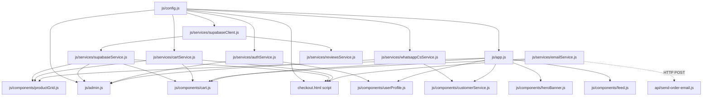

# MUSTAZ CRAFT — CODEBASE MAP & ARCHITECTURE TOPOLOGY

Dokumen ini memetakan arsitektur, struktur file, dependensi, dan integrasi eksternal dari repository **MUSTAZ CRAFT**. Dokumen ini dibuat berdasarkan audit langsung pada source code tanpa fabrikasi atau asumsi.

---

## 1. Struktur Folder

```text
mustaz_buildtest/
├── admin/                         # Area Admin Console
│   ├── css/
│   │   ├── admin.css              # Styling dashboard admin
│   │   └── auth.css               # Styling modal login admin
│   └── index.html                 # Halaman utama Admin Dashboard
├── api/                           # Backend Serverless Functions (Vercel)
│   └── send-order-email.js        # Vercel serverless function (Resend API email order)
├── assets/                        # Static assets (gambar produk, UI, background)
│   ├── banner/                    # Banner hero & event
│   ├── best-seller/               # Gambar item best seller
│   ├── flash-sale/                # Banner / aset flash sale
│   ├── icons/                     # Favicon, svg, icon navigasi
│   ├── new-arrival/               # Aset produk rilis terbaru
│   ├── products/                  # Foto katalog produk gunpla/craft
│   ├── reviews/                   # Foto testimoni pembeli
│   └── torn-paper/                # Aset dekorasi visual rustic
├── css/                           # Styling Utama Website Pembeli
│   ├── cart.css                   # Drawer keranjang & checkout floating modal
│   ├── customer-service.css       # Floating widget WhatsApp CS
│   ├── feed.css                   # Styling community feed / galeri
│   ├── style.css                  # Core CSS, typography, layout, reset
│   └── user-profile.css           # Modal riwayat pesanan & profil pembeli
├── docs/                          # Dokumentasi Teknis & Audit Arsitektur
│   ├── CODEBASE_MAP.md            # Peta codebase & topologi dependensi
│   └── FULL_SYSTEM_AUDIT.md       # Laporan komprehensif audit sistem
├── js/                            # Logika Frontend & Layanan Aplikasi
│   ├── components/                # Komponen UI modular
│   │   ├── cart.js                # Drawer cart, kupon, checkout trigger
│   │   ├── customerService.js     # Floating WhatsApp CS modal
│   │   ├── feed.js                # Community posts / user gallery
│   │   ├── heroBanner.js          # Carousel / dynamic hero banner
│   │   ├── productGrid.js         # Rendering katalog, filter, search
│   │   └── userProfile.js         # Modal profil user & order history tab
│   ├── services/                  # Service layer & business logic
│   │   ├── apiService.js          # Mock API / legacy clothing store fallback
│   │   ├── authService.js         # Supabase Auth, session, admin role gate
│   │   ├── cartService.js         # Operasi keranjang & local dynamic parts
│   │   ├── emailService.js        # Panggilan ke /api/send-order-email
│   │   ├── reviewsService.js      # Fetch & submit ulasan produk Supabase
│   │   ├── supabaseClient.js      # Supabase REST client wrapper & fetcher
│   │   ├── supabaseService.js     # CRUD produk, orders, & admin database sync
│   │   └── whatsappCsService.js   # Generator template pesan WhatsApp CS
│   ├── admin.js                   # Controller utama Admin Console (/admin)
│   ├── app.js                     # Bootstrap entry point halaman pembeli
│   └── config.js                  # Konfigurasi global (Supabase URL, Keys, Currency)
├── ALUR_PEMESANAN_MUSTAZ.md       # Dokumentasi flow pemesanan & SOP transaksi
├── checkout.html                  # Halaman checkout standalone (alternatif modal)
├── index.html                     # Entry point website pembeli (Single Page Architecture)
├── package.json                   # Dependency node (resend, serve, dll.)
├── supabase_security_rules.sql    # Skrip SQL DDL, RLS, and functions
├── SUPABASE_SETUP.md              # Panduan setup awal Supabase manual
└── vercel.json                    # Konfigurasi routing Vercel & CORS headers
```

---

## 2. Fungsi Masing-Masing Folder

| Folder | Tanggung Jawab Utama |
|---|---|
| `/` (Root) | Entry point halaman publik (`index.html`, `checkout.html`), skrip database (`*.sql`), panduan setup, dan config server. |
| `/admin` | Dashboard operasional toko: manajemen inventori/katalog produk, pemrosesan order, verifikasi bukti bayar, input resi pengiriman, dan pelacakan revenue. |
| `/api` | Serverless backend API yang dijalankan oleh runtime Vercel Node.js untuk tugas rahasia/backend (pengiriman email transactional via Resend API). |
| `/assets` | Asset grafis statis: foto produk lokal, banner promo, tekstur kertas robek (torn-paper), dan icon UI. |
| `/css` | Arsitektur stylesheet modular berbasis Vanilla CSS tanpa framework (responsif, utility variables, tema gelap & rustic). |
| `/docs` | Dokumentasi arsitektur sistem, audit keamanan, topologi kode, dan rencana migrasi. |
| `/js` | Logika aplikasi Vanilla JavaScript (ES6 Modules) yang terbagi menjadi komponen UI (`components/`) dan business logic/data layer (`services/`). |

---

## 3. Fungsi Masing-Masing File Penting

### Root & Pages
- [`index.html`](file:///home/hann/Desktop/mustaz_buildtest/index.html): Halaman utama e-commerce MUSTAZ CRAFT. Memuat katalog produk, banner hero, flash sale, testimoni, community feed, modal keranjang, modal profil pembeli, dan floating WhatsApp CS widget.
- [`checkout.html`](file:///home/hann/Desktop/mustaz_buildtest/checkout.html): Halaman checkout mandiri dengan ringkasan order, form data pengiriman, pemilihan kurir, kalkulasi ongkir, dan tombol submit pesanan.
- [`package.json`](file:///home/hann/Desktop/mustaz_buildtest/package.json): Mendefinisikan metadata project, server lokal (`serve`), dan SDK email (`resend`).
- [`vercel.json`](file:///home/hann/Desktop/mustaz_buildtest/vercel.json): Konfigurasi hosting Vercel dengan rules routing serverless function `/api/send-order-email.js`.
- [`supabase_security_rules.sql`](file:///home/hann/Desktop/mustaz_buildtest/supabase_security_rules.sql): Skrip SQL mendefinisikan tabel `products`, `orders`, `order_items`, `users`, `reviews`, Row-Level Security (RLS) policies, dan helper function `public.is_admin()`.
- [`SUPABASE_SETUP.md`](file:///home/hann/Desktop/mustaz_buildtest/SUPABASE_SETUP.md): Panduan inisialisasi tabel Supabase untuk developer.

### Backend (`/api`)
- [`api/send-order-email.js`](file:///home/hann/Desktop/mustaz_buildtest/api/send-order-email.js): Endpoint HTTP POST Vercel serverless. Menerima payload order, memformat template invoice HTML, dan mengirimkan email konfirmasi ke pembeli via Resend API (`RESEND_API_KEY`).

### Core Scripts (`/js`)
- [`js/config.js`](file:///home/hann/Desktop/mustaz_buildtest/js/config.js): Single source of configuration untuk:
  - Supabase URL & Anon Public Key
  - Nomor WhatsApp resmi Admin/Toko (`62895325604340`)
  - Kurs mata uang (`CURRENCY_RATES.USD_TO_IDR = 16000`)
  - Helper formatting mata uang (`formatCurrency(amount, targetCurrency)`)
  - Event channel constants (`APP_EVENTS`)
- [`js/app.js`](file:///home/hann/Desktop/mustaz_buildtest/js/app.js): Bootstrap frontend pembeli. Menginisialisasi modul navigasi, filter kategori, switcher mata uang (IDR/USD), hero banner, product grid, cart modal, user profile, dan floating CS.
- [`js/admin.js`](file:///home/hann/Desktop/mustaz_buildtest/js/admin.js): Controller Admin Console. Mengatur autentikasi admin (`enforceAdminRole`), pemuatan order & produk dari Supabase, tab filtering, CRUD produk/stok, verifikasi status bayar, input resi, dan tombol aksi WhatsApp berfase.

### UI Components (`/js/components`)
- [`js/components/cart.js`](file:///home/hann/Desktop/mustaz_buildtest/js/components/cart.js): Mengelola drawer keranjang belanja, kupon promo, checkout modal langsung di `index.html`, form alamat pengiriman, dan dispatching order ke Supabase & WhatsApp.
- [`js/components/productGrid.js`](file:///home/hann/Desktop/mustaz_buildtest/js/components/productGrid.js): Mengambil data produk (Supabase + fallback lokal), rendering kartu produk, handling filter kategori, pencarian realtime, badge diskon/flash sale, dan event "Add to Cart".
- [`js/components/heroBanner.js`](file:///home/hann/Desktop/mustaz_buildtest/js/components/heroBanner.js): Carousel banner hero interaktif di beranda.
- [`js/components/customerService.js`](file:///home/hann/Desktop/mustaz_buildtest/js/components/customerService.js): Modal bantuan WhatsApp CS untuk tanya stok, custom craft, komplain, atau lacak paket.
- [`js/components/userProfile.js`](file:///home/hann/Desktop/mustaz_buildtest/js/components/userProfile.js): Drawer/modal akun pembeli: login/logout Supabase, tab riwayat pesanan (`ORDER HISTORY`), dan modal input ulasan produk.
- [`js/components/feed.js`](file:///home/hann/Desktop/mustaz_buildtest/js/components/feed.js): Galeri komunitas pembeli/kolektor (Instagram/feed mock) dengan fitur like dan modal detail karya.

### Services Layer (`/js/services`)
- [`js/services/supabaseClient.js`](file:///home/hann/Desktop/mustaz_buildtest/js/services/supabaseClient.js): Wrapper fetch native yang berkomunikasi langsung ke Supabase PostgREST endpoint menggunakan header `apikey` dan `Authorization`.
- [`js/services/supabaseService.js`](file:///home/hann/Desktop/mustaz_buildtest/js/services/supabaseService.js): Service operasi data Supabase: `getProducts()`, `createOrder()`, `getAllOrders()`, `updateOrderStatus()`, `deleteOrder()`, `saveProduct()`, `deleteProduct()`.
- [`js/services/authService.js`](file:///home/hann/Desktop/mustaz_buildtest/js/services/authService.js): Service autentikasi: `signUp()`, `signIn()`, `signOut()`, `getCurrentUser()`, listener session Supabase, dan helper role admin (`isUserAdmin()`, `verifyAdminSession()`).
- [`js/services/cartService.js`](file:///home/hann/Desktop/mustaz_buildtest/js/services/cartService.js): State manager keranjang: `getCart()`, `addToCart()`, `removeFromCart()`, `updateQuantity()`, `clearCart()`, `deductProductStock()`, dan kupon diskon.
- [`js/services/whatsappCsService.js`](file:///home/hann/Desktop/mustaz_buildtest/js/services/whatsappCsService.js): Formatter template pesan WhatsApp Admin-to-Customer (Fase 1: Rekening, Fase 2: Verifikasi, Fase 3: Resi, Fase 4: Review).
- [`js/services/emailService.js`](file:///home/hann/Desktop/mustaz_buildtest/js/services/emailService.js): Client invoker yang mengirimkan payload order ke `/api/send-order-email`.
- [`js/services/reviewsService.js`](file:///home/hann/Desktop/mustaz_buildtest/js/services/reviewsService.js): Mengelola fetch ulasan dari tabel `reviews` Supabase dan submit ulasan baru.
- [`js/services/apiService.js`](file:///home/hann/Desktop/mustaz_buildtest/js/services/apiService.js): Mock data service legacy (sampel pakaian/hoodie & feedback form) yang sebagian besar sudah superseded oleh `supabaseService.js`.

---

## 4. Dependensi Antar File



---

## 5. Entry Point Aplikasi (Buyer Web)

- **URL**: `/` atau `/index.html`
- **Script Pemuat**: `<script type="module" src="js/app.js"></script>`
- **Siklus Hidup Startup**:
  1. `app.js` memanggil `initApp()`.
  2. Setup Event Listeners (`setupCurrencyToggle()`, `setupCategoryNav()`, `setupSearch()`).
  3. Modul di-load secara paralel:
     - `initHeroBanner()`
     - `initProductGrid()` (fetch produk dari Supabase via `supabaseService.getProducts()`)
     - `initCart()` (inisialisasi drawer keranjang, counter badge, event listener checkout)
     - `initFeed()` (load feed komunitas)
     - `initUserProfile()` (cek session login Supabase via `authService.initAuth()`)
     - `initCustomerService()` (floating icon WA)

---

## 6. Entry Point Admin Console

- **URL**: `/admin` atau `/admin/index.html`
- **Script Pemuat**: `<script type="module" src="js/admin.js"></script>`
- **Siklus Hidup Startup**:
  1. `admin.js` memanggil `initAdminDashboard()`.
  2. Binding Event Listener Tab & Tombol (Defensive Bootstrap).
  3. Memeriksa Otorisasi Admin:
     - Memanggil `authService.verifyAdminSession()`.
     - Jika role bukan `admin`, menampilkan overlay `#adminAuthOverlay` (Login Admin).
  4. Pemuatan Data Operasional:
     - `loadAdminProducts()` (fetch Supabase `products`, render tabel stok/produk).
     - `loadAdminOrders()` (fetch Supabase `orders`, render daftar pesanan & metrics).

---

## 7. Entry Point Checkout

Sistem saat ini memiliki **dua jalur checkout**:

### Jalur A: Modal Checkout di `index.html` (Primary Flow)
- **Komponen**: `js/components/cart.js`
- **Trigger**: Klik tombol `Checkout Sekarang` di Drawer Keranjang (`#checkoutBtn`).
- **Elemen UI**: Modal inline `#checkoutModal` di dalam `index.html`.
- **Fungsi Eksekusi**: `handleCheckoutSubmit(event)` di `js/components/cart.js`.

### Jalur B: Standalone Checkout Page (Alternative / Legacy Flow)
- **URL**: `/checkout.html`
- **Trigger**: Akses URL langsung atau redirect jika modal di-disable.
- **Script**: Script inline modul di bawah halaman `checkout.html`.
- **Fungsi Eksekusi**: `processCheckout()` di `checkout.html`.

---

## 8. Entry Point Supabase

- **Base URL**: `CONFIG.SUPABASE_URL` (`https://wzftmqunxyfqmgbndhyk.supabase.co`)
- **API Client**: Native `fetch` HTTP via REST PostgREST (`/rest/v1/...`) di [`js/services/supabaseClient.js`](file:///home/hann/Desktop/mustaz_buildtest/js/services/supabaseClient.js).
- **Auth Client**: Supabase GoTrue Auth REST endpoints (`/auth/v1/...`) di [`js/services/authService.js`](file:///home/hann/Desktop/mustaz_buildtest/js/services/authService.js).
- **Tabel Database Utama**:
  1. `products`: Katalog item, nama, harga, stok, gambar, kategori.
  2. `orders`: Pesanan pembeli, data pemesan, total amount, status, nomor resi.
  3. `order_items`: Relasi item pesanan (didefinisikan di SQL, namun client saat ini menyimpan item sebagai string di `orders.items`).
  4. `users`: Metadata role pengguna (`admin` / `customer`).
  5. `reviews`: Rating bintang dan ulasan testimoni pembeli.

---

## 9. Semua Service & API Eksternal

1. **Supabase PostgREST & Auth**:
   - Endpoint: `https://wzftmqunxyfqmgbndhyk.supabase.co`
   - Kredensial: `CONFIG.SUPABASE_ANON_KEY` (client-side public key).
   - Penggunaan: Database storage untuk produk, order, review, dan autentikasi user.
2. **WhatsApp Web / Mobile (`wa.me`)**:
   - Endpoint: `https://wa.me/{phone}?text={encoded_message}`
   - Penggunaan:
     - Pembeli mengirim format order awal ke Admin (`62895325604340`).
     - Admin mengirim pesan CS terstruktur ke Pembeli (Fase 1 Rekening, Fase 2 Verifikasi, Fase 3 Resi, Fase 4 Review).
3. **Vercel Serverless Function**:
   - Endpoint: `/api/send-order-email`
   - File: `api/send-order-email.js`
   - Penggunaan: Mengirimkan email konfirmasi pesanan otomatis ke email pembeli saat checkout berhasil.
4. **Resend API**:
   - Provider: Resend (`https://api.resend.com/emails`)
   - Kredensial: Environment variable backend `RESEND_API_KEY`.
   - Penggunaan: Transactional email delivery engine.
